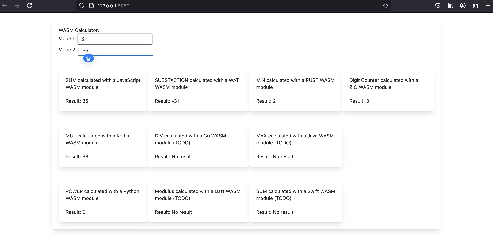

# One Ring to rule ...

or somehow a theatrical introduction would be. 

Target of this POC is to demonstate how many programming languages are already WASM Compatible and could exchange modules from one to the other language. 

In this case there is a Rust Leptos Frontend consuming mathematical operations provided from different languages. 

To not install all the languages, the build is done with Docker Images and build Scripts.

*Build WASM modules* : docker-compose up --build

| *module*   | *language* |    | *module*  | *language* |    | *module*   | *language* |
|------------|------------|----|-----------|------------|----|------------|------------|
| wasm-add   | Typescript |    | wasm-mul  | Kotlin     |    | wasm-power | Python     | 
| wasm-sub   | WAT        |    | wasm-div  | Go         |    | wasm-mod   | Dart       |
| wasm-min   | Rust       |    | wasm-max  | Java       |    |            |            |

executing the Leptos application, you need have installed Rust + Trunk

*Executing frontend* : trunk serve

Links:

https://www.assemblyscript.org/introduction.html#from-a-webassembly-perspective

https://wa2.dev/